# Einrichten und Verwalten Ihrer Content-KI-Quellen

Dieses Handbuch führt Sie durch das Einrichten von Content-KI-Quellen in Cloud Manager - von der Erfüllung der Voraussetzungen bis zur Erstellung einer Inhaltsquelle und der Bestätigung, dass sie indiziert und verfügbar ist.

## Voraussetzungen {#prerequisites}

Bevor Sie beginnen, stellen Sie sicher, dass die folgenden Bedingungen erfüllt sind:

* Sie haben ein gültiges Cloud Manager-Programm mit mindestens einer AEM as a Cloud Service-Umgebung.
* Sie haben die **[Systemadministrator](https://experienceleague.adobe.com/en/docs/support-resources/adobe-support-tools-guide/adobe-admin-console/admin-roles)**-Rolle in Admin Console für das Programm.
* Das Umgebungs-Produktprofil wurde in **Adobe Admin Console** bereitgestellt. Siehe [Einrichten eines Adobe Developer Console-Projekts](setup-adc-project.md).

## Schritt 1: Öffnen der Registerkarte Content-KI-Konfiguration {#open-tab}

1. Melden Sie sich bei [Cloud Manager an &#x200B;](https://my.cloudmanager.adobe.com/) wählen Sie Ihr Programm aus.

   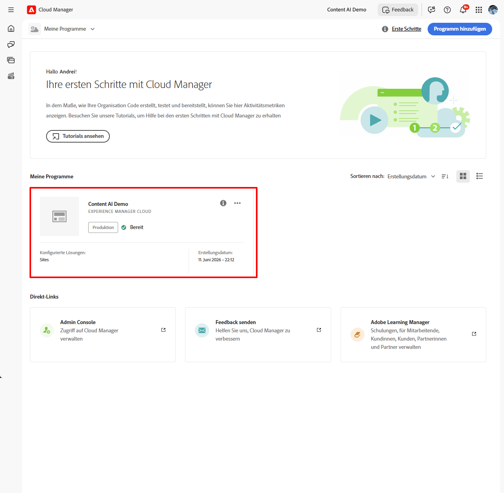

1. Suchen Sie in **[!UICONTROL Programmübersicht]** den Abschnitt **[!UICONTROL Umgebungen]** und wählen Sie die zu konfigurierende Umgebung aus.

   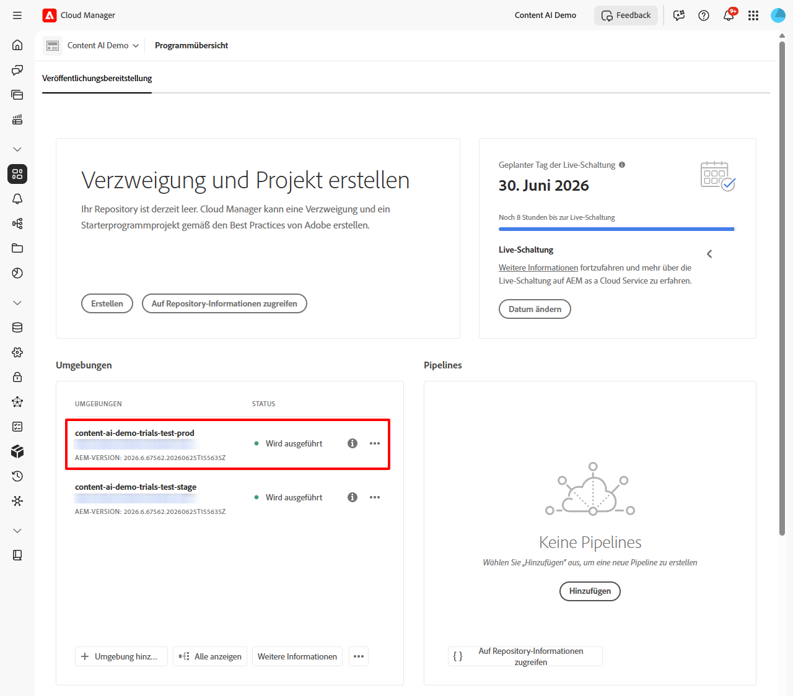

1. Wählen Sie auf der Seite mit den Umgebungsdetails die Registerkarte **[!UICONTROL Content-KI-Konfiguration]** aus.

   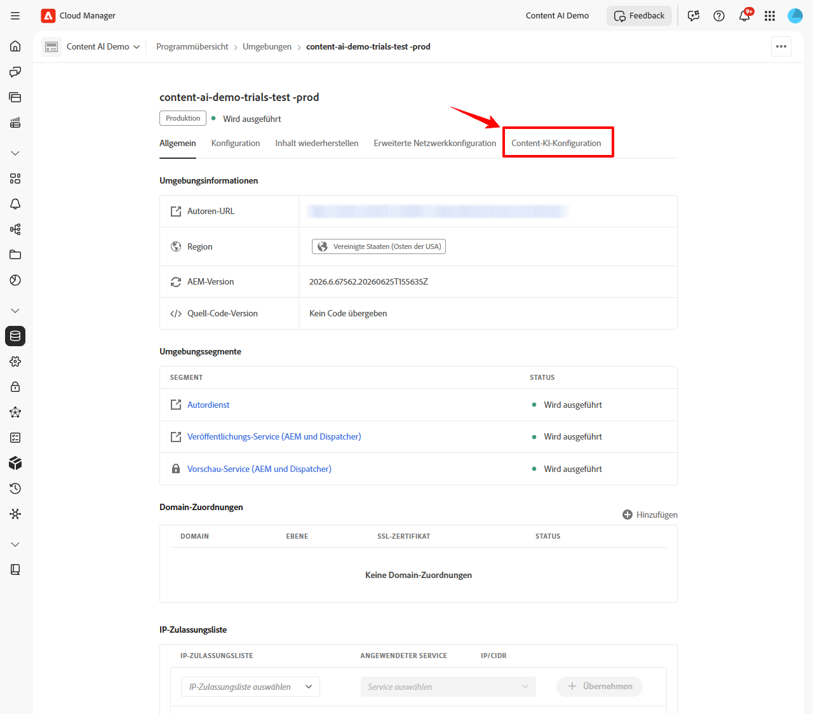

## Schritt 2: Erstellen einer Content-KI-Source {#create-source}

Eine Inhaltsquelle definiert die Website, die Content-KI crawlen und indiziert.

1. Wählen Sie auf der Registerkarte **[!UICONTROL Content]** KI-Konfiguration“ **[!UICONTROL Source erstellen]** aus.

   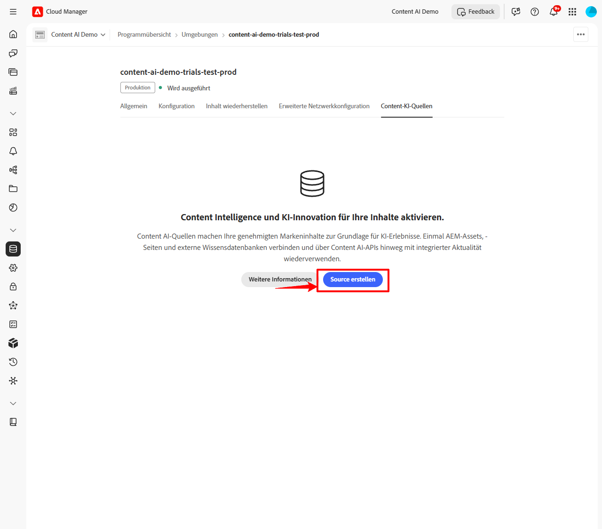

1. Füllen **[!UICONTROL im Dialogfeld &quot;Source für]** Content-KI erstellen/hinzufügen“ die folgenden Felder aus:

   | Feld | Beschreibung |
   | --- | --- |
   | **[!UICONTROL Konfigurationsname der Content-KI]** | Eine eindeutige Kennung für diese Quelle (z. B. `my-site-index`). Kann nach der Erstellung nicht mehr geändert werden. |
   | **[!UICONTROL Beschreibung]** | *(Optional)* Eine kurze Beschreibung der Inhaltsquelle. |
   | **[!UICONTROL Website-Adresse]** | Die Stamm-URL der zu crawlen Website (z. B. `https://www.example.com/`). |
   | **[!UICONTROL URLs ausschließen]** | *(Optional)* URL-Muster, die beim crawlen übersprungen werden sollen. |
   | **[!UICONTROL Häufigkeit der Aktualisierung]** | Wie oft Content AI die Quelle erneut crawlen: Wöchentlich, Täglich, Täglich 4×, 60 Minuten oder 15 Minuten. |

   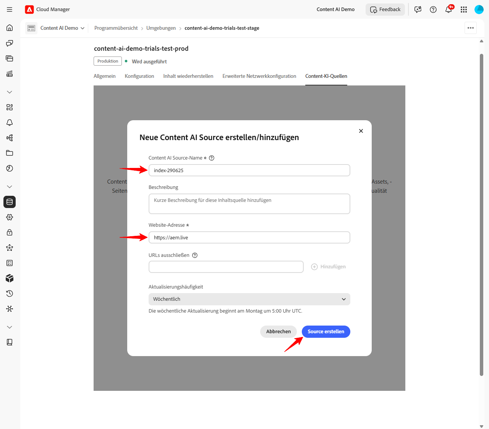

   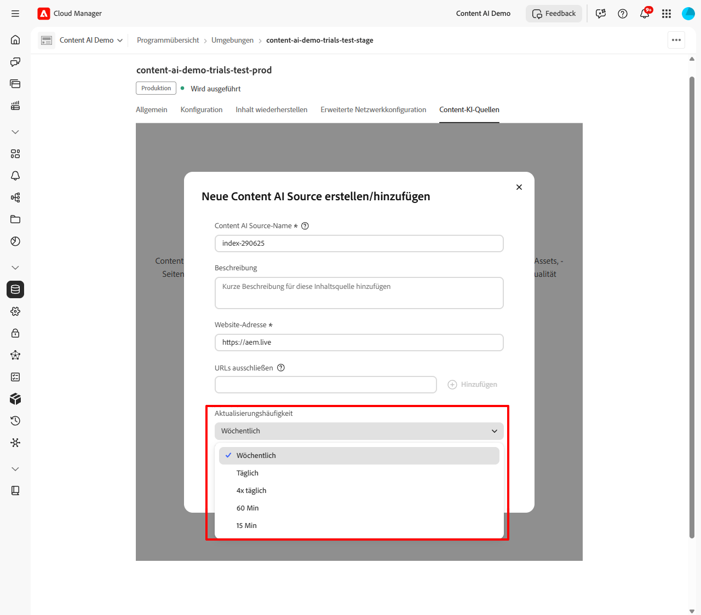

1. Wählen Sie **[!UICONTROL Source erstellen]** aus.

## &#x200B;3. Schritt - Trigger-Akquise {#trigger-acquisition}

Nachdem die Quelle erstellt wurde, lautet ihr Status **Neu**. Führen Sie eine erste Akquise aus, um mit der Indizierung zu beginnen.

1. Klicken Sie in der Quellliste auf das Symbol **Mehr Aktionen** (…) neben Ihrer Quelle und wählen Sie dann **[!UICONTROL Trigger-Akquise]**.

   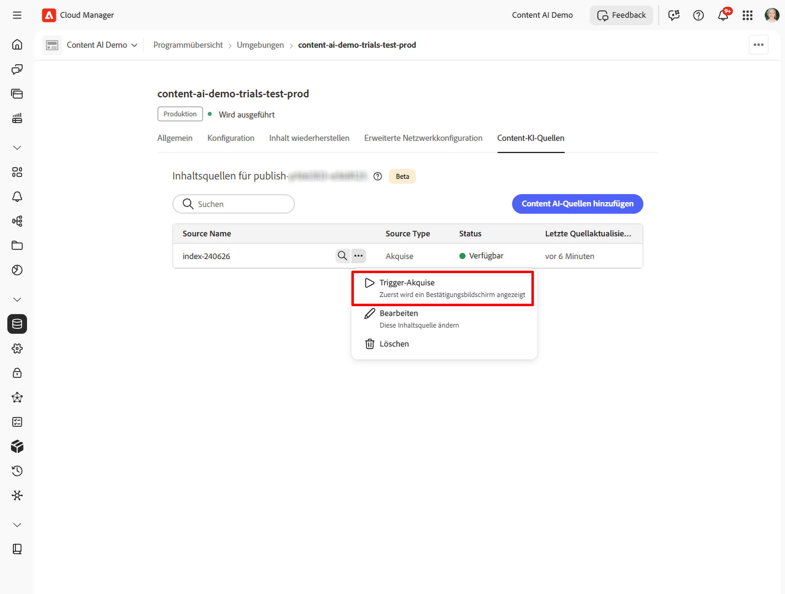

1. Überprüfen Sie im Dialogfeld **&#x200B;**&#x200B;die Quelldetails - **[!UICONTROL Inhaltsquelle]**, **[!UICONTROL Letzte Ausführung]** und **[!UICONTROL Nächste geplante Ausführung]** - und wählen Sie **[!UICONTROL Trigger]**.

   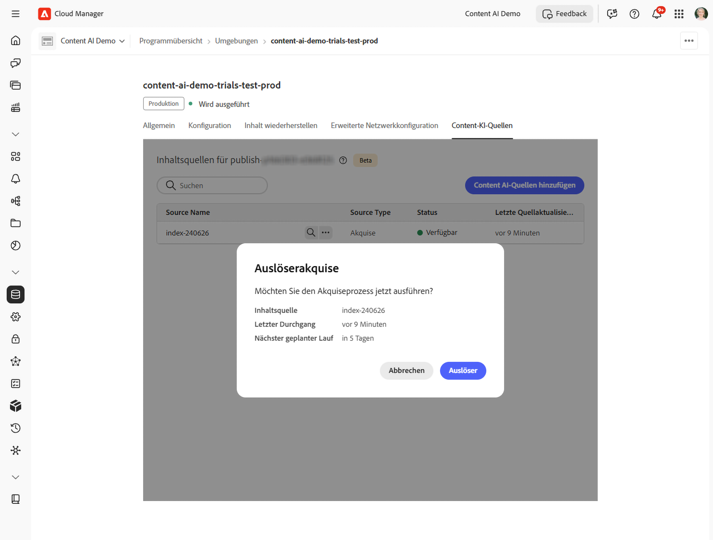

## Schritt 4: Überwachen des Indexstatus {#monitor-status}

Nach dem Beginn der Akquise wird der Quellstatus in Echtzeit aktualisiert.

| Status | Bedeutung |
| --- | --- |
| **Neu** | Source wurde erstellt. Es wurde noch keine Akquise durchgeführt. |
| **Indizierung** | Akquise läuft; Inhalte werden crawlen und indiziert. |
| **Verfügbar** | Die Indizierung ist abgeschlossen. Die Quelle kann jetzt Suchabfragen bereitstellen. |

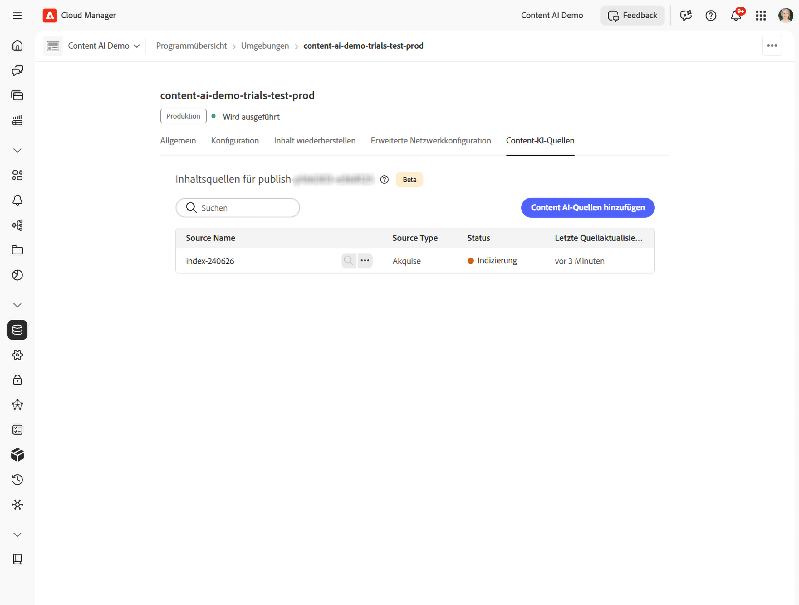

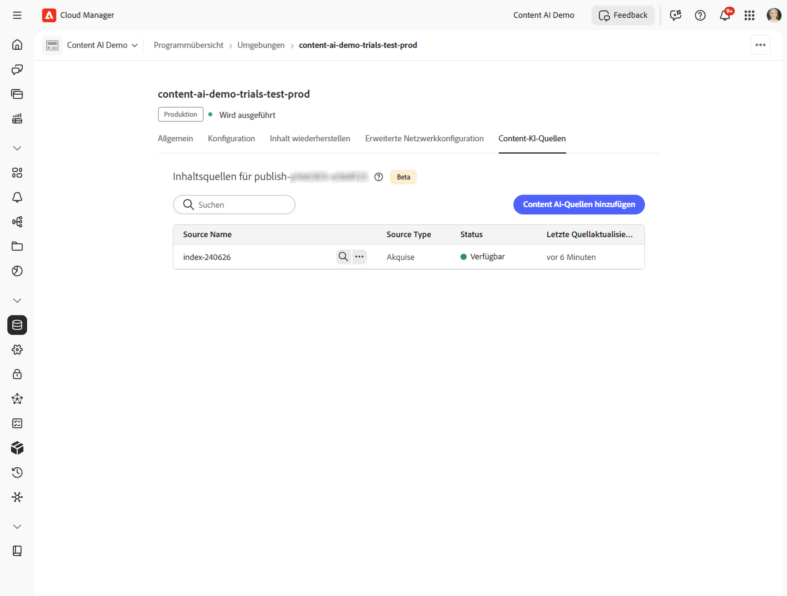

Warten Sie, bis der Status **Verfügbar“ erreicht**, bevor Sie den Index durchsuchen oder die API testen.

## Schritt 5: Durchsuchen indizierter Inhalte {#search-content}

Sobald der Quellstatus &quot;**&quot; ist** können Sie Suchabfragen direkt in Cloud Manager ausführen, um zu überprüfen, ob die Inhalte korrekt indiziert wurden.

1. Wählen Sie in der Quellliste **[!UICONTROL Suchen]** neben Ihrer Quelle aus.

   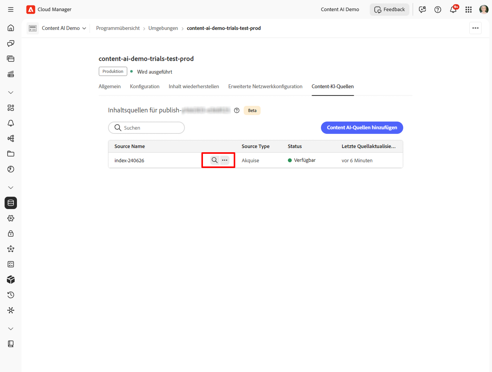

1. Geben Sie eine Abfrage in das Suchfeld ein. Die Ergebnisse zeigen eine Liste übereinstimmender Elemente mit einem Übereinstimmungswert und einem Inhaltstyp (z. B **„PAGE** oder **PDF**). Wenn Sie ein Ergebnis auswählen, wird eine Vorschau auf der rechten Seite geöffnet.

   

## Ändern oder Löschen einer Source {#modify-source}

So aktualisieren Sie eine Quellkonfiguration, nachdem sie erstellt wurde:

1. Klicken Sie in der Quellliste auf das Symbol **Mehr Aktionen** (…) neben der Quelle und dann auf **[!UICONTROL Bearbeiten]**.

   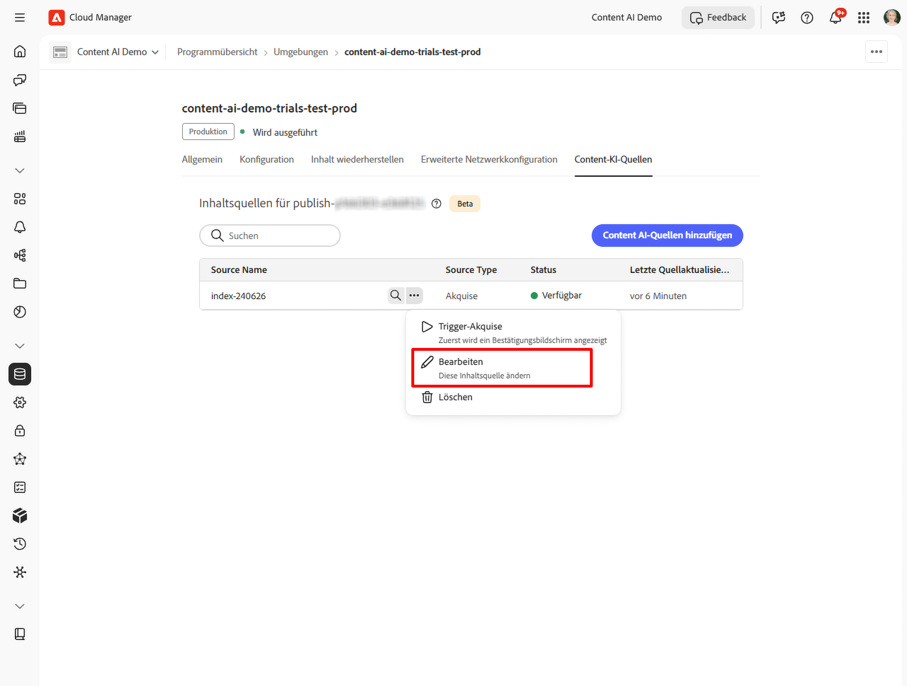

1. Aktualisieren **[!UICONTROL im Dialogfeld Ändern der Content-KI-]**&quot; bei Bedarf **[!UICONTROL Beschreibung]**, **[!UICONTROL Website-]**, **[!UICONTROL URLs]** oder **[!UICONTROL Aktualisierungshäufigkeit]**. Der **[!UICONTROL Name der Content]** KI-Konfiguration“ ist schreibgeschützt und kann nicht geändert werden.

1. Wählen Sie **[!UICONTROL Speichern]**, um die Änderungen anzuwenden, oder wählen Sie **[!UICONTROL Löschen]** unten links im Dialogfeld aus, um die Quelle vollständig zu entfernen.

   >[!WARNING]
   >
   >Das Löschen einer Quelle ist dauerhaft. Alle indizierten Inhalte für diese Quelle werden entfernt und können keine Suchabfragen mehr bereitstellen.

   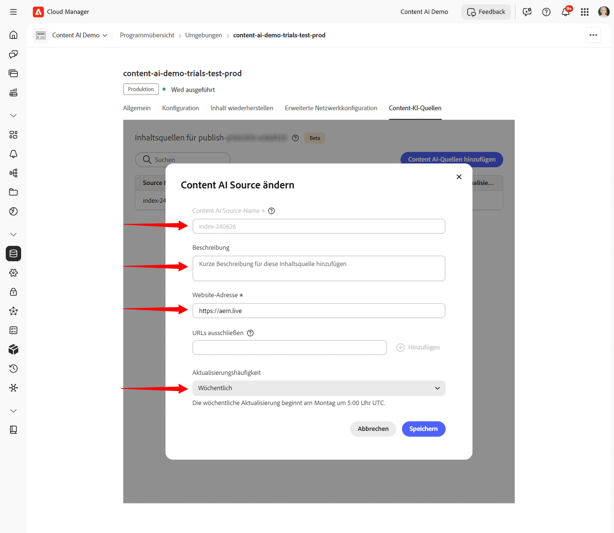

Die Quellliste wird mit Ihren Änderungen aktualisiert. Wenn Sie die Quelle gelöscht haben, wird sie nicht mehr in der Liste angezeigt.

## Nächste Schritte {#next-steps}

* [Adobe Developer Console-Projekt einrichten](setup-adc-project.md) - Erstellen Sie das ADC-Projekt und die Anmeldeinformationen, die Sie für den Aufruf der API benötigen.
* [Content AI-API-Referenz](https://developer.adobe.com/experience-cloud/experience-manager-apis/api/experimental/contentai/) - Abfragen indizierter Inhalte mithilfe von semantischen, Volltext- oder Hybrid-Suchendpunkten.

## Fehlerbehebung {#troubleshooting}

* **Source verbleibt [!UICONTROL Indizierung] für einen längeren Zeitraum.** Wiederholen Sie die Akquise über das Menü (…). Wenn der Status nach einer zweiten Ausführung nicht angezeigt wird, stellen Sie sicher, dass die **[!UICONTROL Website-]**) öffentlich erreichbar ist und dass die **[!UICONTROL URLs ausschließen]**-Muster nicht jede Seite herausfiltern.
* **Source wechselt nach [!UICONTROL &#x200B; Ausführung zurück &#x200B;]Neu** Der Crawler konnte keine Seiten aus der konfigurierten Stamm-URL abrufen. Bestätigen Sie, dass die URL mit `200 OK` antwortet und dass die Site keine automatisierten Anfragen blockiert.
* **[!UICONTROL Suche] gibt keine Ergebnisse für eine [!UICONTROL Verfügbare] Quelle zurück** Die Indizierung war erfolgreich, aber kein Inhalt stimmte mit der Abfrage überein. Versuchen Sie eine breitere Abfrage oder überprüfen Sie, ob die crawlen URLs die erwarteten Seiten enthalten.
