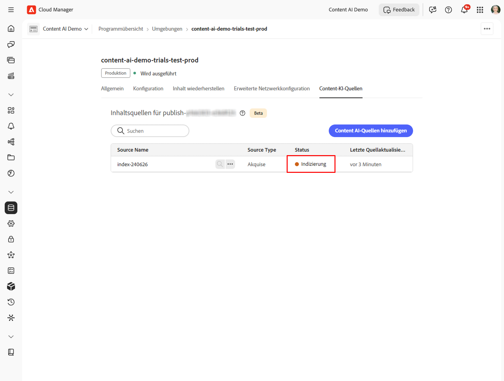

# Einrichten und Verwalten Ihrer Content-KI-Quellen

Dieses Handbuch führt Sie durch das Einrichten von Content-KI-Quellen in Cloud Manager - von der Erfüllung der Voraussetzungen bis zur Erstellung einer Inhaltsquelle und der Bestätigung, dass sie indiziert und verfügbar ist.

## Voraussetzungen {#prerequisites}

Bevor Sie beginnen, stellen Sie sicher, dass die folgenden Bedingungen erfüllt sind:

* Sie haben ein gültiges Cloud Manager-Programm mit mindestens einer AEM as a Cloud Service-Umgebung.
* Ihre Benutzerin bzw. Ihr Benutzer ist dem Produktprofil **AEM-** für die Zielumgebung zugewiesen, über das die Benutzerin bzw. der Benutzer Inhaltsquellen anzeigen kann.
* Ihre Benutzerin bzw. Ihr Benutzer ist dem Produktprofil **AEM-** für die Zielumgebung zugewiesen, mit dem die Benutzerin bzw. der Benutzer Inhaltsquellen erstellen und bearbeiten kann. Der Zugriff auf Cloud Manager allein ist nicht ausreichend - siehe [Zuweisen eines Benutzers zu einem AEM-Produktprofil](#assign-product-profile) unten.
* Das Umgebungs-Produktprofil wurde in **Adobe Admin Console bereitgestellt**.

## Zuweisen eines Benutzers zu einem AEM-Produktprofil {#assign-product-profile}

Gehen Sie wie folgt vor, um einem Benutzer Zugriff auf [!DNL Adobe Experience Manager] as a Cloud Service für eine bestimmte Umgebung zu gewähren. Weisen Sie das Profil zu, das dem Zugriff entspricht, den der Benutzer benötigt:

* **[!UICONTROL AEM-]**: Inhaltsquellen anzeigen.
* **[!UICONTROL AEM-]**: Erstellen und Bearbeiten von Inhaltsquellen.

>[!NOTE]
>
>Benutzer müssen einem AEM-Produktprofil angehören, z. B. **[!UICONTROL AEM-]** oder **[!UICONTROL AEM-]**, um auf AEM zugreifen zu können. Der Zugriff auf Cloud Manager allein reicht nicht aus.

Um diese Profile zuzuweisen, müssen Sie Systemadministrator mit dem Cloud Manager-Produktprofil [!UICONTROL Geschäftsinhaber] sein. Halten Sie den Namen und die E-Mail-Adresse des Benutzers bereit.

1. Navigieren Sie in  zu Ihrem Programm und wählen Sie &quot;**[!UICONTROL verwalten“]** die Zielumgebung aus. Für diese Umgebung wird eine neue Registerkarte [!DNL Adobe Admin Console].
1. Wählen Sie das Produktprofil **[!UICONTROL AEM-]** oder **[!UICONTROL AEM-]** für die **Veröffentlichungs** Ebene aus, z. B. `AEM Administrators - publish - Program 12345 - Environment 67890`. Content AI indiziert veröffentlichte Inhalte, sodass das Profil auf Veröffentlichungsebene zugewiesen werden muss, nicht auf der Autorenebene.
1. Wählen Sie **[!UICONTROL Benutzende hinzufügen]** aus.
1. Geben Sie den Namen und die E-Mail-Adresse des Benutzers ein und speichern Sie dann die Änderung. Der Benutzer wird dem Produktprofil hinzugefügt.

Wiederholen Sie diese Schritte für jede Umgebung, in der der Benutzer Zugriff benötigt, z. B. Entwicklung, Staging oder Produktion.

>[!CAUTION]
>
>Die Standardproduktprofile mit den Namen **[!UICONTROL AEM-Administratoren oder {]**} AEM-Benutzer dürfen nicht bearbeitet oder gelöscht ]**.**[!UICONTROL  Beim Umbenennen von **[!UICONTROL AEM]** Administratoren werden Administratorrechte von allen ihnen zugewiesenen entfernt.

### Zuweisung überprüfen {#verify-assignment}

So überprüfen Sie, ob die Zuweisung erfolgreich war:

1. Öffnen Sie [!DNL Admin Console] das von Ihnen zugewiesene Produktprofil erneut.
1. Bestätigen Sie, dass der Benutzer in der Mitgliederliste angezeigt wird.

Wenn Sie Zugriffs- oder Token-Probleme beheben möchten, vergewissern Sie sich, dass der Benutzer direkt zum Produktprofil hinzugefügt wird und nicht nur über eine Gruppe.

## Schritt 1: Öffnen der Registerkarte Content-KI-Konfiguration {#open-tab}

1. Melden Sie sich bei [Cloud Manager an ](https://my.cloudmanager.adobe.com/) wählen Sie Ihr Programm aus.

   

1. Suchen Sie in **[!UICONTROL Programmübersicht]** den Abschnitt **[!UICONTROL Umgebungen]** und wählen Sie die zu konfigurierende Umgebung aus.

   

1. Wählen Sie auf der Seite mit den Umgebungsdetails die Registerkarte **[!UICONTROL Content-KI-Konfiguration]** aus.

   

## Schritt 2: Erstellen einer Content-KI-Source {#create-source}

Eine Inhaltsquelle definiert die Website, die Content-KI crawlen und indiziert.

1. Wählen Sie auf der Registerkarte **[!UICONTROL Content]** KI-Konfiguration“ **[!UICONTROL Source erstellen]** aus.

   

1. Füllen **[!UICONTROL im Dialogfeld &quot;Source für]** Content-KI erstellen/hinzufügen“ die folgenden Felder aus:

   | Feld | Beschreibung |
   | --- | --- |
   | **[!UICONTROL Konfigurationsname der Content-KI]** | Eine eindeutige Kennung für diese Quelle (z. B. `my-site-index`). Kann nach der Erstellung nicht mehr geändert werden. |
   | **[!UICONTROL Beschreibung]** | *(Optional)* Eine kurze Beschreibung der Inhaltsquelle. |
   | **[!UICONTROL Website-Adresse]** | Die Stamm-URL der zu crawlen Website (z. B. `https://www.example.com/`). |
   | **[!UICONTROL URLs ausschließen]** | *(Optional)* URL-Muster, die beim crawlen übersprungen werden sollen. |
   | **[!UICONTROL Häufigkeit der Aktualisierung]** | Wie oft Content AI die Quelle erneut crawlen: Wöchentlich, Täglich, Täglich 4×, 60 Minuten oder 15 Minuten. |

   

   

1. Wählen Sie **[!UICONTROL Source erstellen]** aus. Die Akquise wird automatisch gestartet und die Quelle wechselt zu **Indizierung**.

   

## &#x200B;3. Schritt - Akquise erneut ausführen {#trigger-acquisition}

Die Akquise wird automatisch ausgeführt, wenn Sie eine Quelle erstellen, und dann nach dem Zeitplan, der durch die **[!UICONTROL Aktualisierungshäufigkeit“ festgelegt]**. Sie können eine Ausführung auch jederzeit manuell als Trigger festlegen, z. B. um die Indizierung sofort nach der Veröffentlichung neuer Inhalte neu durchzuführen.

1. Klicken Sie in der Quellliste auf das Symbol **Mehr Aktionen** (…) neben Ihrer Quelle und wählen Sie dann **[!UICONTROL Trigger-Akquise]**.

   

1. Überprüfen Sie im Dialogfeld **** die Quelldetails - **[!UICONTROL Inhaltsquelle]**, **[!UICONTROL Letzte Ausführung]** und **[!UICONTROL Nächste geplante Ausführung]** - und wählen Sie **[!UICONTROL Trigger]**.

   

## Schritt 4: Überwachen des Indexstatus {#monitor-status}

Nach dem Beginn der Akquise wird der Quellstatus in Echtzeit aktualisiert.

| Status | Bedeutung |
| --- | --- |
| **Neu** | Source hat gerade erstellt. Die automatische Akquise hat noch nicht begonnen. Dieser Status ist kurz. |
| **Indizierung** | Akquise läuft; Inhalte werden crawlen und indiziert. |
| **Verfügbar** | Die Indizierung ist abgeschlossen. Die Quelle kann jetzt Suchabfragen bereitstellen. |

Warten Sie, bis der Status **Verfügbar“ erreicht**, bevor Sie den Index durchsuchen oder die API testen.

## Schritt 5: Durchsuchen indizierter Inhalte {#search-content}

Sobald der Quellstatus &quot;**&quot; ist** können Sie Suchabfragen direkt in Cloud Manager ausführen, um zu überprüfen, ob die Inhalte korrekt indiziert wurden.

1. Wählen Sie in der Quellliste das Symbol **Suchen** (Lupe) neben Ihrer Quelle aus.

   

1. Geben Sie eine Abfrage in das Suchfeld ein. Die Ergebnisse zeigen eine Liste übereinstimmender Elemente mit einem Übereinstimmungswert und einem Inhaltstyp (z. B **„PAGE** oder **PDF**). Wenn Sie ein Ergebnis auswählen, wird eine Vorschau auf der rechten Seite geöffnet.

   

## Ändern oder Löschen einer Source {#modify-source}

### Ändern einer Quelle {#modify}

So aktualisieren Sie eine Quellkonfiguration, nachdem sie erstellt wurde:

1. Klicken Sie in der Quellliste auf das Symbol **Mehr Aktionen** (…) neben der Quelle und dann auf **[!UICONTROL Bearbeiten]**.

   

1. Aktualisieren **[!UICONTROL im Dialogfeld Ändern der Content-KI-]**&quot; bei Bedarf **[!UICONTROL Beschreibung]**, **[!UICONTROL Website-]**, **[!UICONTROL URLs]** oder **[!UICONTROL Aktualisierungshäufigkeit]**. Der **[!UICONTROL Name der Content]** KI-Konfiguration“ ist schreibgeschützt und kann nicht geändert werden.

   

1. Wählen **[!UICONTROL Speichern]**, um die Änderungen anzuwenden. Die Quellliste wird mit Ihren Änderungen aktualisiert.

### Löschen einer Quelle {#delete}

1. Wählen Sie in der Quellliste das Symbol **Mehr Aktionen** (…) neben der Quelle aus und klicken Sie dann auf **[!UICONTROL Löschen]**.

   >[!WARNING]
   >
   >Das Löschen einer Quelle ist dauerhaft. Alle indizierten Inhalte für diese Quelle werden entfernt und können keine Suchabfragen mehr bereitstellen.

Nach dem Löschen wird die Quelle nicht mehr in der Liste angezeigt.

## Nächste Schritte {#next-steps}

* [Adobe Developer Console-Projekt einrichten](setup-adc-project.md) - Erstellen Sie das ADC-Projekt und die Anmeldeinformationen, die Sie für den Aufruf der API benötigen.
* [Content AI-API-Referenz](https://developer.adobe.com/experience-cloud/experience-manager-apis/api/experimental/contentai/) - Abfragen indizierter Inhalte mithilfe von semantischen, Volltext- oder Hybrid-Suchendpunkten.

## Fehlerbehebung {#troubleshooting}

* **Source verbleibt [!UICONTROL Indizierung] für einen längeren Zeitraum.** Wiederholen Sie die Akquise über das Menü (…). Wenn der Status nach einer zweiten Ausführung nicht angezeigt wird, stellen Sie sicher, dass die **[!UICONTROL Website-]**) öffentlich erreichbar ist und dass die **[!UICONTROL URLs ausschließen]**-Muster nicht jede Seite herausfiltern.
* **Source wechselt nach [!UICONTROL  Ausführung zurück ]Neu** Der Crawler konnte keine Seiten aus der konfigurierten Stamm-URL abrufen. Bestätigen Sie, dass die URL mit `200 OK` antwortet und dass die Site keine automatisierten Anfragen blockiert.
* **[!UICONTROL Suche] gibt keine Ergebnisse für eine [!UICONTROL Verfügbare] Quelle zurück** Die Indizierung war erfolgreich, aber kein Inhalt stimmte mit der Abfrage überein. Versuchen Sie eine breitere Abfrage oder überprüfen Sie, ob die crawlen URLs die erwarteten Seiten enthalten.
