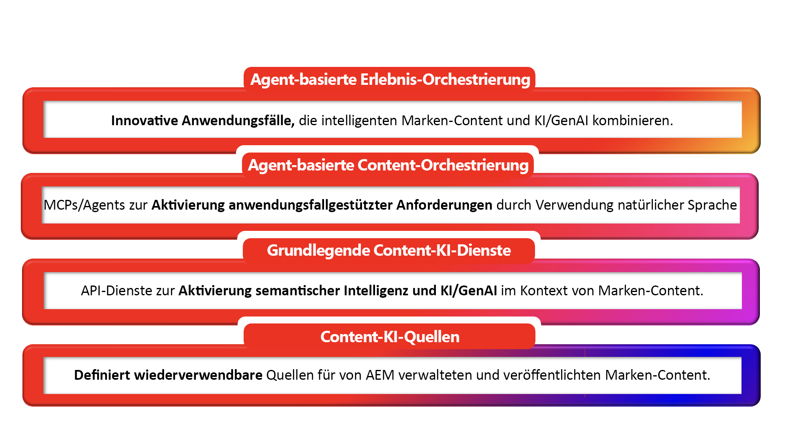

# AEM Content AI - Einführung

## Intelligente Inhalte, KI-fähig (Design) {#ai-ready}

Kunden beginnen damit, Marken über KI zu begegnen, bevor sie jemals auf eine Website treffen. Chatassistenten, KI-Übersichten, Agenten, Konversationssuche, KI-Concierges - alle rufen Markeninhalte im Namen der Marke ab, fassen sie zusammen und stellen sie dar. Was sie sagen, ist nur so genau, aktuell und markenintern wie die Inhalte, die sie erreichen können.
Für diese Verschiebung ist die AEM Content-KI konzipiert. Sie behandelt Markeninhalte als die Grundwahrheit, auf der KI-Erlebnisse ausgeführt werden - und gibt AEM-Kunden die Tools an die Hand, um diese Grundwahrheit auf Autorenseite schneller zu erstellen und sie für verbraucherorientierte KI-gesteuerte Erlebnisse auf Veröffentlichungsseite sauber bereitzustellen.

**Auf der Autorenseite** die Erstellung von AEM Content AI in genehmigten Markenquellen. Mit KI-unterstützter Inhaltserstellung, der Erkennung natürlicher Sprachen für vorhandene Seiteninhalte, Fragmente und Assets sowie der markenbewussten Generierung können Teams Varianten für neue Zielgruppen, Regionen und Kanäle erstellen, ohne AEM verlassen zu müssen und ohne von dem abzuweichen, was bereits genehmigt wurde.

**Auf der Veröffentlichungsseite** derselbe Inhalt für KI strukturiert, gesteuert und adressierbar. Fragmente, Metadaten, Taxonomien und genehmigte Quellen werden in Formen verfügbar gemacht, die Abrufsysteme, Agenten und Gesprächsschnittstellen mit Zuversicht verwenden können - wenn also KI für die Marke spricht, sagt sie die Wahrheit der Marke aus.

### Was dies für AEM-Kunden bedeutet {#what-it-means}

Genehmigte Inhalte sind die Verteidigung der Marke gegen Halluzinationen. Wenn KI auf regulierten AEM-Inhalten basiert, bleiben Antworten standardmäßig korrekt, aktuell und markenintern.
Die Inhaltserstellung hält mit der Nachfrage im KI-Zeitalter Schritt. Teams generieren Kopien und Bilder für weitere Zielgruppen und Momente innerhalb des Authoring-Erlebnisses - aus genehmigten Quellen, anstatt leer zu beginnen.
Entdeckung funktioniert so, wie Menschen und Maschinen tatsächlich fragen. Die zielbasierte Suche in natürlicher Sprache nach Assets, Fragmenten, Seiten und Formularen wandelt vorhandene Inhalte in eine wiederverwendbare Quelle um.
Personalization skaliert durch Wiederverwendung, nicht durch Duplizierung. Gesteuerte Komponenten werden zu Varianten neu kombiniert, anstatt sich zu nicht verfolgten Kopien zu vermehren.
Veröffentlichungskanäle enthalten jetzt KI-Oberflächen. Inhalte werden in Formen bereitgestellt, die Menschen, Agenten und KI-vermittelte Erlebnisse alle konsumieren können - ohne separate Pipelines für jede Konfiguration.

**Der größere Punkt: Vorhandene vertrauenswürdige Markeninhalte sind jetzt wertvoller als je zuvor. Jedes genehmigte Fragment, Asset und jede bereits in AEM vorhandene Seite wird zur Grundwahrheit, von der KI-gesteuerte Erlebnisse abhängen - und AEM Content AI macht diese Bibliothek wiederverwendbar, auffindbar und bereit für das, was als Nächstes kommt.**

## AEM Content-KI auf einen Blick {#at-a-glance}

AEM Content AI ist als vierschichtiger Stack strukturiert - jede Ebene baut auf der unten stehenden auf, von den vertrauenswürdigen Inhalten auf der Grundlage bis zu den agenten Erlebnissen, die sie an der Spitze unterstützt.

*Lesen Sie den Stack von unten nach oben - von den vertrauenswürdigen Inhalten bei der Foundation bis zu den agentischen Erlebnissen, die es ermöglicht, an der Spitze.*

1. Content-KI-Quellen
Inhaltsquellen sind verwaltete Entitäten in der AEM Content AI, die eine Verbindung zu einem vertrauenswürdigen Inhaltskörper herstellen. Ein Content Source kann auf einen von AEM verwalteten Inhaltstyp wie Assets, Inhaltsfragmente, Seiten, Formulare, Metadaten und Taxonomien sowie auf Nicht-AEM-Quellen wie Websites, Wissensdatenbanken oder Dokumentationsportale von Drittanbietern verweisen. Jeder Content Source wird automatisch vektorisiert und semantisch angereichert, um Abruf, Erdung und dialogorientierte KI-Erlebnisse zu ermöglichen. Einmalige Definition von Inhaltsquellen und deren Wiederverwendung über Inhalts-KI-APIs hinweg mit integrierter automatischer Aktualität und Aktualisierungen.

1. Content AI - Foundation Services
Die APIs und Services, die semantische Intelligenz und generative KI im Kontext von Markeninhalten ermöglichen. Diese Services basieren auf Content-KI-Quellen und ermöglichen das Abrufen, Generieren, markenbewusste Variation und Optimierung - alles basierend auf genehmigten Inhalten des Kunden.

1. Agent-Inhaltsorchestrierung
MCPs und Agenten, die anwendungsspezifische Inhaltsanforderungen durch natürliche Sprache in koordiniertes Handeln umwandeln. Auf dieser Ebene können Autoren und andere Agenten beschreiben, was sie benötigen, und die richtigen grundlegenden Dienste koordiniert haben, um es zu erfüllen.

1. Agent-Erlebnisorchestrierung
Die innovativen Anwendungsfälle, die entstehen, wenn intelligente Markeninhalte in großem Maßstab auf KI treffen. AEM-Lösungen selbst basieren auf diesen grundlegenden Services - und Kundinnen und Kunden können dieselben APIs direkt verwenden, um eigene agentische Erlebnisse für ihre eigenen Inhalte zu erstellen. Von KI-gestützten Inhaltslieferketten bis hin zu dialogorientierten Journey-Anwendern - auf dieser Ebene werden verwaltete Inhalte zu einem Wettbewerbsvorteil.

Diese Ebenen sind durch ihr Design miteinander verbunden: Jeder KI-Service greift auf die Grundlage der Inhalte zurück, und alles, was produziert wird, fließt in dasselbe geregelte System zurück - sodass die Erstellung auf der Autoren- und Veröffentlichungsseite sowie die Bereitstellung eine gemeinsame Datenquelle haben.

## AEM Content AI in Aktion {#action}

Der Weg zu einer funktionierenden Content AI-Integration umfasst zwei Aufgaben:

### &#x200B;1. Aktivieren von Content-KI für Ihre AEM-Umgebung {#enable}

**Voraussetzung:** Bevor Sie mit der Verwendung von Content-KI beginnen, benötigen Sie API-Anmeldeinformationen, die sich auf Ihre AEM as a Cloud Service-Umgebung beziehen. Siehe [Einrichten eines Adobe Developer Console-](setup-adc-project.md).

### &#x200B;2. Steuern von Content-KI-Quellen {#control}

Richten Sie Ihre Inhalts-KI-Quellen ein und verwalten Sie sie, um KI-basierte Erlebnisse zu aktivieren. Weitere Informationen finden [&#x200B; unter „Steuern &#x200B;](contentsources.md) Inhaltsquellen“.

## Kennenlernen von Content-APIs  {#apis}

Entdecken Sie die Funktionsvielfalt von AEM Content AI - die APIs zeigen das volle Potenzial der Plattform auf. Siehe [Content AI-APIs](https://developer.adobe.com/experience-cloud/experience-manager-apis/api/experimental/contentai/).
