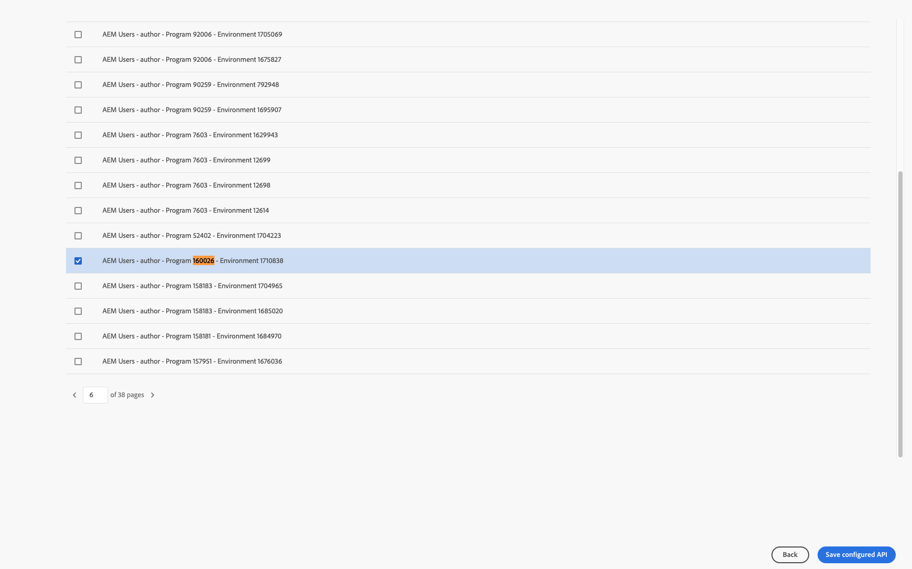
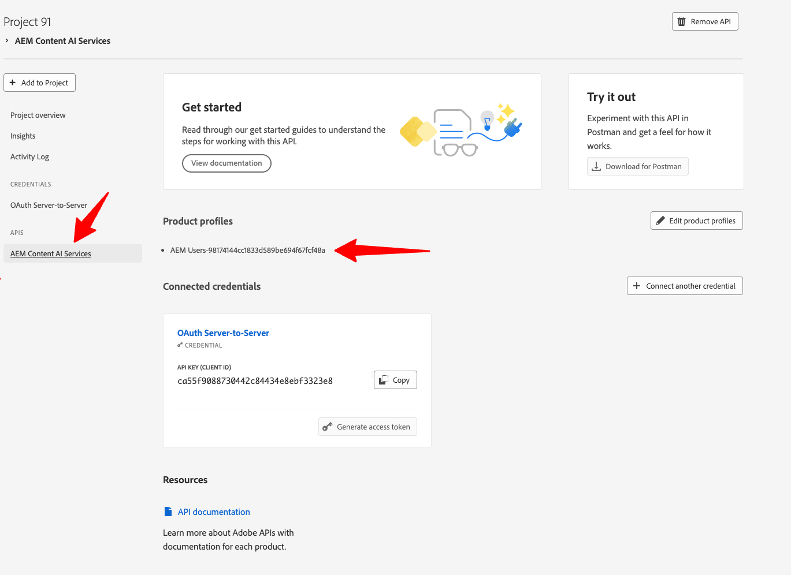
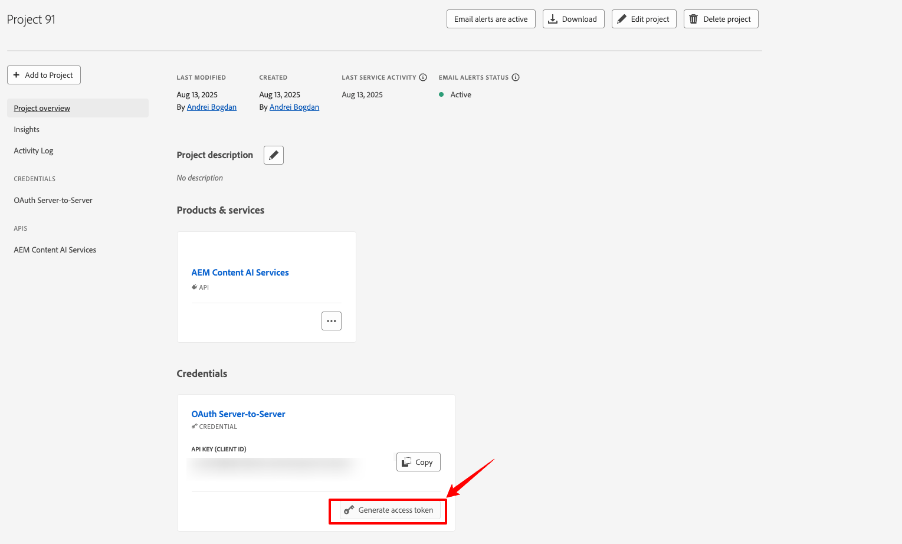

# Einrichten eines Adobe Developer Console-Projekts {#configure-adc-project}

Um die AEM Content AI Services-API aufzurufen, benötigen Sie Anmeldedaten, die von einem Adobe Developer Console-Projekt (ADC) ausgestellt wurden. Diese Seite führt Sie durch die Erstellung des Projekts, die Auswahl einer Authentifizierungsmethode und die Erstellung der Anmeldeinformationen, die Sie in jede API-Anfrage einbeziehen.

Gehen Sie zu [Adobe Developer Console](https://developer.adobe.com/console/), damit Ihre Organisation beginnen kann.

## Voraussetzungen {#prerequisites}

Bevor Sie beginnen, stellen Sie Folgendes sicher:

* Sie haben Zugriff auf [Adobe Developer Console](https://developer.adobe.com/console/) für Ihr Unternehmen.
* Sie werden als **Entwickler** zum Produktprofil AEM Content AI Services in **Adobe Admin Console** hinzugefügt. Ohne diese Rolle ist die **[!UICONTROL AEM Content AI Services]**-API-Karte deaktiviert und die **[!UICONTROL Server-zu-Server]**-Authentifizierungsoption ist ausgeblendet.
* Sie kennen die Programm- und Umgebungsnummern für das Produktprofil, das Sie auswählen möchten (z. B. `AEM User - publish - Program 12345 - Environment 67890`).

## Authentifizierungsmethode auswählen {#choose-auth}

AEM Content AI Services unterstützt zwei Authentifizierungsmethoden. Wählen Sie die aus, die Ihrer Integration entspricht:

| Methode | Am besten geeignet für |
| --- | --- |
| [Server-zu-Server](#s2s-auth) | Backend-Services, die die API ohne Benutzerinteraktion aufrufen. Gibt ein kurzlebiges Zugriffstoken zurück. |
| [API-Schlüssel](#api-key-auth) | Client-seitige oder Browser-basierte Integrationen, die die API direkt aufrufen. Gibt einen langlebigen Schlüssel zurück, der unter die zulässigen Domains fällt. |

## Server-zu-Server-Authentifizierung {#s2s-auth}

1. Wählen Sie **[!UICONTROL APIs und Services]** und dann **[!UICONTROL APIs]** aus.

   

1. Filtern Sie nach **AEM Content AI Services** und wählen Sie dann **[!UICONTROL Projekt erstellen]**, um ein neues Projekt zu starten, oder **[!UICONTROL API hinzufügen]**, wenn Sie den Service zu einem vorhandenen Projekt hinzufügen.

   >[!NOTE]
   >
   >Wenn die API-Karte durch die Meldung „Lizenz erforderlich“ deaktiviert wird, wird Ihre AEM as a Cloud Service-Umgebung möglicherweise nicht modernisiert. Siehe [Modernisierung der AEM as a Cloud Service-](https://experienceleague.adobe.com/de/docs/experience-manager-learn/cloud-service/aem-apis/openapis/setup#modernization-of-aem-as-a-cloud-service-environment).

1. Wählen **[!UICONTROL Dialogfeld „API konfigurieren]** die Authentifizierung **[!UICONTROL Server-zu-Server]** aus.

   

   >[!TIP]
   >
   >Wenn die Option Server-zu-Server nicht verfügbar ist, wird der Benutzer, der die Integration einrichtet, nicht als Entwickler zum Produktprofil hinzugefügt. Siehe [Aktivieren der Server-zu-Server-Authentifizierung](https://developer.adobe.com/developer-console/docs/guides/authentication/ServerToServerAuthentication/implementation).

1. Benennen Sie die Berechtigung bei Bedarf um. Wählen Sie **[!UICONTROL Weiter]** aus.

   Schritt 

1. Wählen Sie das Produktprofil **[!UICONTROL AEM-Benutzer - Veröffentlichen - Programm XXX - Umgebung XXX]** und/oder **[!UICONTROL AEM-Benutzer - Autor - Programm XXX - Umgebung XXX]** aus und klicken Sie dann auf **[!UICONTROL Speichern]**.

   

1. Überprüfen Sie die API- und Authentifizierungskonfiguration.

   

   

### Erstellen eines Zugriffs-Tokens {#generate-token}

1. Wechseln Sie in Ihrem ADC-Projekt zu **[!UICONTROL Anmeldeinformationen]** und wählen Sie **[!UICONTROL Zugriffstoken erstellen]** aus.

   

1. Fügen Sie das Token in die `Authorization` jeder API-Anfrage ein:

   ```http
   Authorization: Bearer YOUR_ACCESS_TOKEN
   ```

   >[!WARNING]
   >
   >Speichern Sie das Token sicher. Sie läuft ab und muss regelmäßig neu generiert werden.

## API-Schlüsselauthentifizierung {#api-key-auth}

1. Wenn Sie die AEM Content AI Services-API zu Ihrem Projekt hinzufügen, wählen Sie **[!UICONTROL API-Schlüssel]** im Dialogfeld **[!UICONTROL Authentifizierungstyp auswählen]** aus.

   

1. Bestätigen Sie die API-Schlüssel-Anmeldedaten.

   

1. Um zu beschränken, welche Ursprünge den Schlüssel verwenden können, konfigurieren Sie die zulässigen Domains.

   

1. Ihr API-Schlüssel (Client-ID) wird unter **[!UICONTROL Verbundene Anmeldeinformationen]** angezeigt. Wählen Sie **[!UICONTROL Kopieren]**.

   

1. Schließen Sie den Schlüssel in jede API-Anfrage ein:

   ```http
   x-api-key: YOUR_API_KEY
   ```

   Ihr Projekt ist jetzt bereit. Verwenden Sie den -Schlüssel bei jeder Anfrage an AEM Content AI Services.

## Nächste Schritte {#next-steps}

* [Steuern Ihrer Inhaltsquellen](contentsources.md) - Konfigurieren einer Inhaltsquelle in Cloud Manager und Trigger-Akquise.
* [Content-API-Referenz](https://developer.adobe.com/experience-cloud/experience-manager-apis/api/experimental/contentai/) - Verwenden Sie Ihr Zugriffstoken oder Ihren API-Schlüssel, um den indizierten Inhalt abzufragen.
